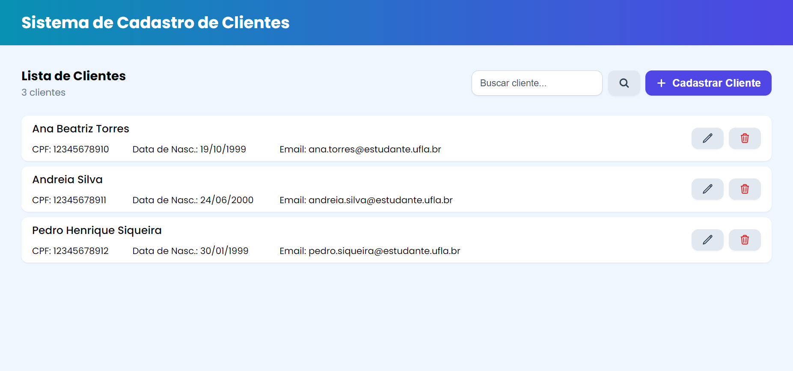

<div align="center">

# Sistema de Cadastro de Clientes


</div>

### GCC180 – Computação em Nuvem

#### Prof. Bruno de Abreu Silva

#### Grupo:

- Ana Beatriz Rodrigues Torres
- Andreia José da Silva
- Pedro Henrique Siqueira

---

## Descrição do Projeto

O projeto consiste no desenvolvimento de um sistema para o cadastro e gerenciamento de clientes. O objetivo principal é criar um sistema que substitua processos manuais e utilize a tecnologia para automatizar o gerenciamento de dados de clientes, permitindo as seguintes operações:

- Cadastrar um novo cliente
- Alterar dados de um cliente existente
- Excluir um cliente existente
- Buscar um cliente pelo nome e/ou CPF
- Listar todos os clientes cadastrados

## Configuração do Sistema

### 1. **Criação da Tabela**

Crie uma conexão com o MySQL e execute o seguinte comando SQL para criar a tabela clientes no banco de dados MySQL:

```sql
CREATE TABLE clientes (
    id INT AUTO_INCREMENT PRIMARY KEY,
    nome VARCHAR(255) NOT NULL,
    cpf VARCHAR(14) NOT NULL,
    dataNascimento DATE NOT NULL,
    email VARCHAR(255) NOT NULL
);
```

### 2. **Configuração das Variáveis de Ambiente**

Crie o arquivo `.env` na pasta `backend` com as seguintes configurações:

```env
DB_HOST=localhost
DB_USER=usuario
DB_PASSWORD=senha
DB_NAME=nome_banco
```

### 3. **Configurações do Frontend**

1.  Navegue até o diretório frontend:

    ```bash
    cd frontend
    ```

2.  Instale as dependências:

    ```bash
    yarn install
    ```

    ou

    ```bash
    npm install
    ```

### 4. **Configurações do Backend**

Para iniciar o backend, siga os seguintes passos:

1.  Navegue até o diretório backend:

    ```bash
    cd backend
    ```

2.  Instale as dependências:

    ```
    yarn install
    ```

    ou

    ```bash
    npm install
    ```

3.  Inicie o servidor:

    ```bash
    node index.js
    ```

### 5. **Utilizando o Sistema**

O sistema estará disponível em http://localhost:3000.
